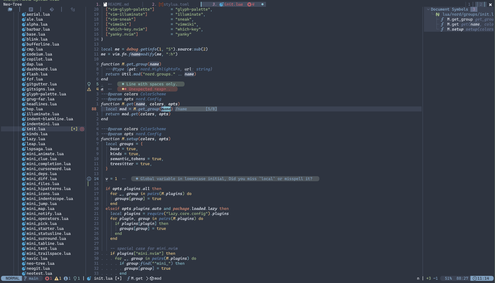

# nord.nvim

[](https://github.com/dupeiran001/nord.nvim/actions/workflows/ci.yml)


Yet Another Nord Theme for NeoVim

using [nord colorpalettes](https://www.nordtheme.com/docs/colors-and-palettes)

Many amazing features **Thanks to [folke/tokyonight.nvim](https://github.com/folke/tokyonight.nvim)**

> [!NOTE]  
>
> the colors may change in future version, makes it looks more likiely to the [VSCode nord](https://www.nordtheme.com/ports/visual-studio-code) and [nord.vim](https://www.nordtheme.com/ports/vim) official repo



## Features:

- Support terminal colors
- Support *Neovim 0.9.0* features
- Support *A Brunch of Plugins*
- Support cache to avoid repeat loading
- Lazy loading plugin specific Highlights on demond


<details>
<summary> Supported Plugins</summary>


<!-- plugins:start -->

| Plugin | Source |
| --- | --- |
| [aerial.nvim](https://github.com/stevearc/aerial.nvim) | [`aerial`](lua/nord/groups/aerial.lua) |
| [ale](https://github.com/dense-analysis/ale) | [`ale`](lua/nord/groups/ale.lua) |
| [alpha-nvim](https://github.com/goolord/alpha-nvim) | [`alpha`](lua/nord/groups/alpha.lua) |
| [barbar.nvim](https://github.com/romgrk/barbar.nvim) | [`barbar`](lua/nord/groups/barbar.lua) |
| [blink.cmp](https://github.com/Saghen/blink.cmp) | [`blink`](lua/nord/groups/blink.lua) |
| [bufferline.nvim](https://github.com/akinsho/bufferline.nvim) | [`bufferline`](lua/nord/groups/bufferline.lua) |
| [nvim-cmp](https://github.com/hrsh7th/nvim-cmp) | [`cmp`](lua/nord/groups/cmp.lua) |
| [codeium.nvim](https://github.com/Exafunction/codeium.nvim) | [`codeium`](lua/nord/groups/codeium.lua) |
| [copilot.lua](https://github.com/zbirenbaum/copilot.lua) | [`copilot`](lua/nord/groups/copilot.lua) |
| [nvim-dap](https://github.com/mfussenegger/nvim-dap) | [`dap`](lua/nord/groups/dap.lua) |
| [dashboard-nvim](https://github.com/nvimdev/dashboard-nvim) | [`dashboard`](lua/nord/groups/dashboard.lua) |
| [flash.nvim](https://github.com/folke/flash.nvim) | [`flash`](lua/nord/groups/flash.lua) |
| [fzf-lua](https://github.com/ibhagwan/fzf-lua) | [`fzf`](lua/nord/groups/fzf.lua) |
| [vim-gitgutter](https://github.com/airblade/vim-gitgutter) | [`gitgutter`](lua/nord/groups/gitgutter.lua) |
| [gitsigns.nvim](https://github.com/lewis6991/gitsigns.nvim) | [`gitsigns`](lua/nord/groups/gitsigns.lua) |
| [glyph-palette.vim](https://github.com/lambdalisue/glyph-palette.vim) | [`glyph-palette`](lua/nord/groups/glyph-palette.lua) |
| [grug-far.nvim](https://github.com/MagicDuck/grug-far.nvim) | [`grug-far`](lua/nord/groups/grug-far.lua) |
| [headlines.nvim](https://github.com/lukas-reineke/headlines.nvim) | [`headlines`](lua/nord/groups/headlines.lua) |
| [hop.nvim](https://github.com/phaazon/hop.nvim) | [`hop`](lua/nord/groups/hop.lua) |
| [vim-illuminate](https://github.com/RRethy/vim-illuminate) | [`illuminate`](lua/nord/groups/illuminate.lua) |
| [indent-blankline.nvim](https://github.com/lukas-reineke/indent-blankline.nvim) | [`indent-blankline`](lua/nord/groups/indent-blankline.lua) |
| [indentmini.nvim](https://github.com/nvimdev/indentmini.nvim) | [`indentmini`](lua/nord/groups/indentmini.lua) |
| [lazy.nvim](https://github.com/folke/lazy.nvim) | [`lazy`](lua/nord/groups/lazy.lua) |
| [leap.nvim](https://github.com/ggandor/leap.nvim) | [`leap`](lua/nord/groups/leap.lua) |
| [lspsaga.nvim](https://github.com/glepnir/lspsaga.nvim) | [`lspsaga`](lua/nord/groups/lspsaga.lua) |
| [mini.animate](https://github.com/echasnovski/mini.animate) | [`mini_animate`](lua/nord/groups/mini_animate.lua) |
| [mini.clue](https://github.com/echasnovski/mini.clue) | [`mini_clue`](lua/nord/groups/mini_clue.lua) |
| [mini.completion](https://github.com/echasnovski/mini.completion) | [`mini_completion`](lua/nord/groups/mini_completion.lua) |
| [mini.cursorword](https://github.com/echasnovski/mini.cursorword) | [`mini_cursorword`](lua/nord/groups/mini_cursorword.lua) |
| [mini.deps](https://github.com/echasnovski/mini.deps) | [`mini_deps`](lua/nord/groups/mini_deps.lua) |
| [mini.diff](https://github.com/echasnovski/mini.diff) | [`mini_diff`](lua/nord/groups/mini_diff.lua) |
| [mini.files](https://github.com/echasnovski/mini.files) | [`mini_files`](lua/nord/groups/mini_files.lua) |
| [mini.hipatterns](https://github.com/echasnovski/mini.hipatterns) | [`mini_hipatterns`](lua/nord/groups/mini_hipatterns.lua) |
| [mini.icons](https://github.com/echasnovski/mini.icons) | [`mini_icons`](lua/nord/groups/mini_icons.lua) |
| [mini.indentscope](https://github.com/echasnovski/mini.indentscope) | [`mini_indentscope`](lua/nord/groups/mini_indentscope.lua) |
| [mini.jump](https://github.com/echasnovski/mini.jump) | [`mini_jump`](lua/nord/groups/mini_jump.lua) |
| [mini.map](https://github.com/echasnovski/mini.map) | [`mini_map`](lua/nord/groups/mini_map.lua) |
| [mini.notify](https://github.com/echasnovski/mini.notify) | [`mini_notify`](lua/nord/groups/mini_notify.lua) |
| [mini.operators](https://github.com/echasnovski/mini.operators) | [`mini_operators`](lua/nord/groups/mini_operators.lua) |
| [mini.pick](https://github.com/echasnovski/mini.pick) | [`mini_pick`](lua/nord/groups/mini_pick.lua) |
| [mini.starter](https://github.com/echasnovski/mini.starter) | [`mini_starter`](lua/nord/groups/mini_starter.lua) |
| [mini.statusline](https://github.com/echasnovski/mini.statusline) | [`mini_statusline`](lua/nord/groups/mini_statusline.lua) |
| [mini.surround](https://github.com/echasnovski/mini.surround) | [`mini_surround`](lua/nord/groups/mini_surround.lua) |
| [mini.tabline](https://github.com/echasnovski/mini.tabline) | [`mini_tabline`](lua/nord/groups/mini_tabline.lua) |
| [mini.test](https://github.com/echasnovski/mini.test) | [`mini_test`](lua/nord/groups/mini_test.lua) |
| [mini.trailspace](https://github.com/echasnovski/mini.trailspace) | [`mini_trailspace`](lua/nord/groups/mini_trailspace.lua) |
| [nvim-navic](https://github.com/SmiteshP/nvim-navic) | [`navic`](lua/nord/groups/navic.lua) |
| [neo-tree.nvim](https://github.com/nvim-neo-tree/neo-tree.nvim) | [`neo-tree`](lua/nord/groups/neo-tree.lua) |
| [neogit](https://github.com/TimUntersberger/neogit) | [`neogit`](lua/nord/groups/neogit.lua) |
| [neorg](https://github.com/nvim-neorg/neorg) | [`neorg`](lua/nord/groups/neorg.lua) |
| [neotest](https://github.com/nvim-neotest/neotest) | [`neotest`](lua/nord/groups/neotest.lua) |
| [noice.dvim](https://github.com/folke/noice.dvim) | [`noice`](lua/nord/groups/noice.lua) |
| [nvim-notify](https://github.com/rcarriga/nvim-notify) | [`notify`](lua/nord/groups/notify.lua) |
| [nvim-tree.lua](https://github.com/kyazdani42/nvim-tree.lua) | [`nvim-tree`](lua/nord/groups/nvim-tree.lua) |
| [octo.nvim](https://github.com/pwntester/octo.nvim) | [`octo`](lua/nord/groups/octo.lua) |
| [rainbow-delimiters.nvim](https://github.com/HiPhish/rainbow-delimiters.nvim) | [`rainbow`](lua/nord/groups/rainbow.lua) |
| [render-markdown.nvim](https://github.com/MeanderingProgrammer/render-markdown.nvim) | [`render-markdown`](lua/nord/groups/render-markdown.lua) |
| [nvim-scrollbar](https://github.com/petertriho/nvim-scrollbar) | [`scrollbar`](lua/nord/groups/scrollbar.lua) |
| [snacks.nvim](https://github.com/folke/snacks.nvim) | [`snacks`](lua/nord/groups/snacks.lua) |
| [vim-sneak](https://github.com/justinmk/vim-sneak) | [`sneak`](lua/nord/groups/sneak.lua) |
| [supermaven-nvim](https://github.com/supermaven-inc/supermaven-nvim) | [`supermaven`](lua/nord/groups/supermaven.lua) |
| [telescope.nvim](https://github.com/nvim-telescope/telescope.nvim) | [`telescope`](lua/nord/groups/telescope.lua) |
| [nvim-treesitter-context](https://github.com/nvim-treesitter/nvim-treesitter-context) | [`treesitter-context`](lua/nord/groups/treesitter-context.lua) |
| [trouble.nvim](https://github.com/folke/trouble.nvim) | [`trouble`](lua/nord/groups/trouble.lua) |
| [vimwiki](https://github.com/vimwiki/vimwiki) | [`vimwiki`](lua/nord/groups/vimwiki.lua) |
| [which-key.nvim](https://github.com/folke/which-key.nvim) | [`which-key`](lua/nord/groups/which-key.lua) |
| [yanky.nvim](https://github.com/gbprod/yanky.nvim) | [`yanky`](lua/nord/groups/yanky.lua) |

<!-- plugins:end -->

</details>

## Installation

with [folke/lazy.nvim](https://github.com/folke/lazy.nvim):

```lua
{
  "dupeiran001/nord.nvim",
  lazy = false,
  priority = 1000,
  opts = {},
}
```

## Usage

add to your config

```lua
vim.cmd[[colorscheme nord]]
```

or 

```vim
colorscheme nord

" There are also colorschemes for the different styles.
colorscheme nord-light
colorscheme nord-night
```


## Plugin specific configuration

<details>
<summary> LuaLine </summary>

* [Lualine](https://github.com/nvim-lualine/lualine.nvim)

```lua
-- Lua
require('lualine').setup {
  options = {
    -- ... your lualine config
    theme = 'nord'
    -- ... your lualine config
  }
}
```

</details>

<details>
<summary> fzf_lua </summary>

* [fzf_lua](https://github.com/ibhagwan/fzf-lua)

For **fzf-lua** to use the highlight groups defined by this colorscheme,
you'll have to set `fzf_colors` to true:

```lua
require("fzf-lua").setup({
    fzf_colors = true
})
```

</details>

<details>
<summary> rainbow_delimiters</summary>

* [rainbow_delimiters](https://github.com/HiPhish/rainbow-delimiters.nvim)

**Its recommended to replace red delimiters with fg:**

```lua
require("rainbow-delimiters.setup").setup({
    highlight = {
		"RainbowDelimiterNormal",
		"RainbowDelimiterOrange",
		"RainbowDelimiterYellow",
		"RainbowDelimiterGreen",
		"RainbowDelimiterCyan",
		"RainbowDelimiterBlue",
		"RainbowDelimiterViolet",
	},
})

```
</details>

<details>
<summary> toggleterm </summary>

* [toggleterm](https://github.com/akinsho/toggleterm.nvim)

```lua
require("toggleterm.nvim").setup({
	highlights = {
		-- highlights which map to a highlight group name and a table of it's values
		Normal = {
			link = "Normal",
		},
		NormalFloat = {
			link = "NormalFloat",
		},
		FloatBorder = {
			link = "FloatBorder",
		},
	},
})
```

</details>

## Configuration

**Make Sure `setup` is called before setting `colorscheme nord`, or default configuration will be applied**

<details>
<summary> Default config</summary>


<!-- config:start -->

```lua
---@class nord.Config
M.defaults = {
  style = "dark", -- The style can ether be 'light' or 'dark'
  transparent = false, -- Whether we should set the background color
  terminal_colors = true, -- Configure the colors used when opening a `:terminal` in Neovim
  dim_inactive = false, -- Dims inactive windows
  lualine_bold = true, -- When `true`, section headers in the lualine theme will be bold

  light_brightness = 0.3, -- Adjusts the brightness of the colors of the **light** style. Number between 0 and 1, from dull to vibrant colors

  styles = {
    -- Style to be applied to different syntax groups
    -- Value is any valid attr-list value for `:help nvim_set_hl`
    comments = { italic = true },
    keywords = { italic = true },
    functions = { italic = true },
    variables = { bold = true },
    -- Background styles. Can be "dark", "transparent" or "normal"
    sidebars = "dark", -- style for sidebars, see below
    floats = "dark", -- style for floating windows
  },

  --- You can override specific highlights to use other groups or a hex color
  --- function will be called with a Highlights and ColorScheme table
  ---@param highlights nord.Highlights
  ---@param colors ColorScheme
  on_highlights = function(highlights, colors) end,

  --- You can override specific color groups to use other groups or a hex color
  --- function will be called with a ColorScheme table
  ---@param colors ColorScheme
  on_colors = function(colors) end,

  cache = true, -- When set to true, the theme will be cached for better performance

  ---@type table<string, boolean|{enabled:boolean}>
  plugins = {
    -- enable all plugins when not using lazy.nvim
    -- set to false to manually enable/disable plugins
    all = package.loaded.lazy == nil,
    -- uses your plugin manager to automatically enable needed plugins
    -- currently only lazy.nvim is supported
    auto = false,
    -- add any plugins here that you want to enable
    -- telescope = true,
  },
}
```

<!-- config:end -->

</details>

## Overriding colors and highlight group 

How the highlight groups are calculated:

1. `colors` are determined based on your configuration, with the ability to
   override them using `config.on_colors(colors)`.
1. These `colors` are utilized to generate the highlight groups.
1. `config.on_highlights(highlights, colors)` can be used to override highlight
   groups.

For default values of `colors` and `highlights`, please consult the

[dark](lua/nord/colors/dark.lua),
[light](lua/nord/colors/light.lua),

<details>
  <summary>Settings & Changing Colors</summary>

```lua
require("nord").setup({
  -- use the night style
  style = "dark",
  -- disable italic for functions
  styles = {
    functions = {}
  },
  -- Change the "hint" color to the "orange" color, and make the "error" color bright red
  on_colors = function(colors)
    colors.hint = colors.orange
    colors.error = "#ff0000"
  end
})
```

</details>

<details>
  <summary>Borderless Telescope</summary>

```lua
require("nord").setup({
  on_highlights = function(hl, c)
    local prompt = "#2d3149"
    hl.TelescopeNormal = {
      bg = c.bg_dark,
      fg = c.fg_dark,
    }
    hl.TelescopeBorder = {
      bg = c.bg_dark,
      fg = c.bg_dark,
    }
    hl.TelescopePromptNormal = {
      bg = prompt,
    }
    hl.TelescopePromptBorder = {
      bg = prompt,
      fg = prompt,
    }
    hl.TelescopePromptTitle = {
      bg = prompt,
      fg = prompt,
    }
    hl.TelescopePreviewTitle = {
      bg = c.bg_dark,
      fg = c.bg_dark,
    }
    hl.TelescopeResultsTitle = {
      bg = c.bg_dark,
      fg = c.bg_dark,
    }
  end,
})
```

</details>

<details>
  <summary>Fix <code>undercurls</code> in Tmux</summary>

To have undercurls show up and in color, add the following to your
[Tmux](https://github.com/tmux/tmux) configuration file:

```sh
# Undercurl
set -g default-terminal "${TERM}"
set -as terminal-overrides ',*:Smulx=\E[4::%p1%dm'  # undercurl support
set -as terminal-overrides ',*:Setulc=\E[58::2::::%p1%{65536}%/%d::%p1%{256}%/%{255}%&%d::%p1%{255}%&%d%;m'  # underscore colours - needs tmux-3.0
```

</details>


## Road Map

- [ ] refactor plugins that need extra configuration into plugin
    - [x] support bufferline with extra configuration (**Thanks to the autocmd solution by [loctvl842/monokai-pro.nvim](https://github.com/loctvl842/monokai-pro.nvim/blob/6c15e36834a624a32f46c6db8f9fc063995b24b6/lua/monokai-pro/autocmds.lua#L7-L28)**)
    - [ ] derive nvim-webdevicon highlights based on colorscheme with extra configuration
- [ ] port vim.nord and vscode.nord highlights
- [ ] fix inlay hint bg in current line
- [ ] fix nord-light theme 
- [ ] fix cmd line cmp popup window highlight
- [ ] fix `qfLineNr` and `TodoBgTODO` in `TodoLocList`
- [ ] add more style support (nord-forest, nord-warmer)
- [ ] support [leetcode.nvim](https://github.com/kawre/leetcode.nvim) => TODO:waiting for upstream
- [x] fix fzf-lua highlights

## FAQ

### Modification to theme does not take effect

- clear cache `~/.cache/nvim/nord-*.json`, and disable `cache` option in nord configuration
- disable `plugins.auto` and enable `plugins.all`, check whether the plugin is loaded (only available in lazy.nvim)

